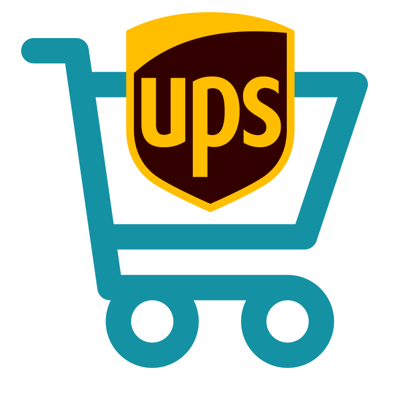
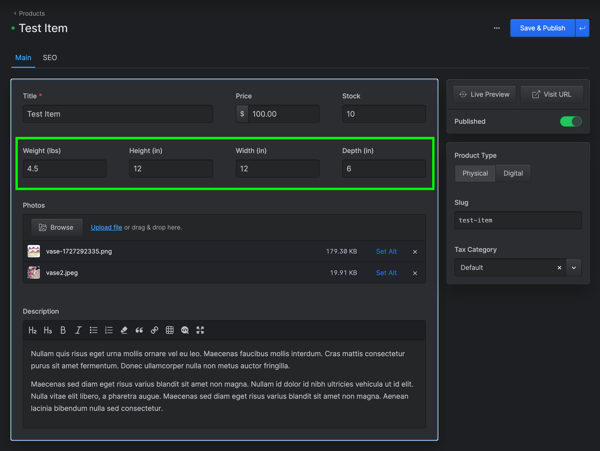

#  Simple Commerce Ups

> Simple Commerce Ups is a Statamic addon that calculates shipping costs based on

## Features

This addon:
- Packs items into preset UPS box sizes using the `dvdoug/boxpacker` library.
- Fetches shipping rates from the UPS rates api.

## How to Install

You can search for this addon in the `Tools > Addons` section of the Statamic control panel and click **install**, or run the following command from your project root:

``` bash
composer require darinlarimore/simple-commerce-ups
```

## How to Use

### API Credentials
In order to use the UPS api, you'll need to do the following:

1. Go to UPS and login to your account.
2. From the Apps section, follow the prompts to create a new app.
3. Copy the Client ID from UPS and paste in the `clientId` field in the config.
4. Copy the Client Secret from UPS and paste in the `clientSecret` field in the config.
6. Copy the Account Number from UPS and paste in the `accountNumber` field in the config.

### Add Fields to your Products
In order for the packing algorhythm to work you must add fields for weight, height, width, and depth to your products. They must have the following handles and types:

<!-- image -->


| Field Name | Field Type * | Field Handle * |
| ---------- | ---------- | ------------ |
| Weight (lbs) | Float      | weight       |
| Height (in) | Float      | height       |
| Width (in) | Float      | width        |
| Depth (in) | Float      | depth        |

\* required

**Note:** The `unitOfMeasurement` and `weightUnitOfMeasurement` can be set in the config file and field names can be changed accordingly.

### Add Shipping Method(s)
For each shipping service you want to use (eg. UPS Ground or UPS 2nd Day Air), you'll need to create a new shipping method in Simple Commerce. To do this,
run `php artisan make:shipping-method UPS-Ground` which will create a new shipping method in `/app/ShippingMethods/UPSGround.php`.

Then inisde the `/app/ShippingMethods/UPSGround.php` file, add the following code:

```php
<?php

namespace App\ShippingMethods;

use DuncanMcClean\SimpleCommerce\Contracts\Order;
use DuncanMcClean\SimpleCommerce\Contracts\ShippingMethod;
use DuncanMcClean\SimpleCommerce\Orders\Address;
use DuncanMcClean\SimpleCommerce\Shipping\BaseShippingMethod;

use Darinlarimore\SimpleCommerceUps\Services\UPS;

class UPSGround extends BaseShippingMethod implements ShippingMethod
{
		public function name(): string
		{
				return __('UPS Ground');
		}

		public function description(): string
		{
				return __('UPS Ground shipping method');
		}

		public function calculateCost(Order $order): int
		{
				$ups = new UPS();
				$rate = $ups->fetchShippingRates($order, 'UPS Ground'); // Pass fetchShippingRates the Order and a service name, in this case 'UPS Ground'.

				return $rate;
		}

		public function checkAvailability(Order $order, Address $address): bool
		{
				return true;
		}
}
```
