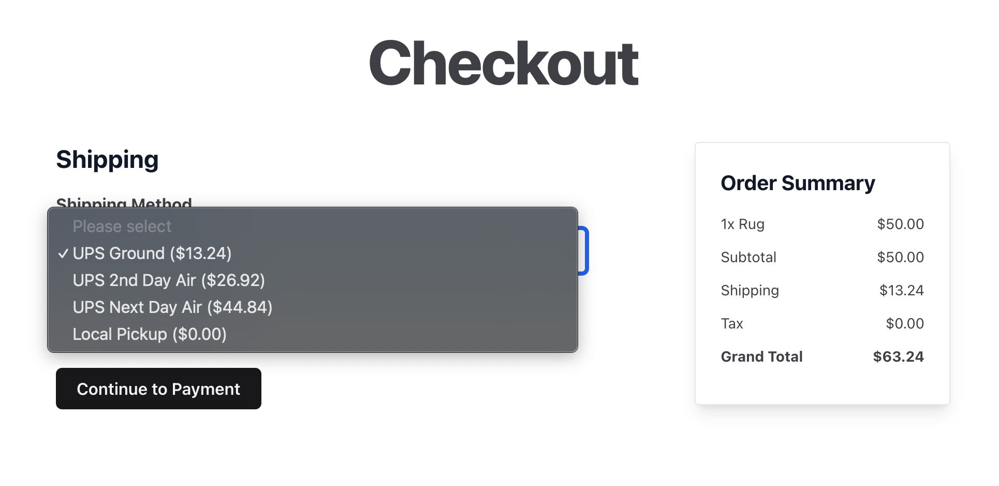

#  Simple Commerce Ups

> Simple Commerce Ups is a Statamic addon that calculates shipping costs from the UPS API.



## Features

This addon:
- Packs items into preset UPS box sizes using the `dvdoug/boxpacker` library.
- Fetches shipping rates from the UPS rates api.

## How to Install

You can search for this addon in the `Tools > Addons` section of the Statamic control panel and click **install**, or run the following command from your project root:

``` bash
composer require darinlarimore/simple-commerce-ups
```

Then, you'll need to publish the config file:

``` bash
php please vendor:publish --tag=simple-commerce-ups-config
```

## Setup Instructions

### API Credentials
In order to use the UPS api, you'll need to do the following:

1. Go to UPS and login to your account.
2. From the Apps section, follow the prompts to create a new app.
3. Copy the Client ID from UPS and paste in the `clientId` field in the config.
4. Copy the Client Secret from UPS and paste in the `clientSecret` field in the config.
6. Copy the Account Number from UPS and paste in the `accountNumber` field in the config.

### Add Fields to your Products


In order for the packing algorhythm to work you must add fields for weight, height, width, and depth to your products. They must have the following handles and types:

| Field Name | Field Type * | Field Handle * |
| ---------- | ---------- | ------------ |
| Weight (lbs) | Float      | weight       |
| Height (in) | Float      | height       |
| Width (in) | Float      | width        |
| Depth (in) | Float      | depth        |

\* required

**Note:** The `unitOfMeasurement` and `weightUnitOfMeasurement` can be set in the config file and field names can be changed accordingly.

### Add Shipping Method(s)
For each shipping service you want to use (eg. UPS Ground or UPS 2nd Day Air), you'll need to create a new shipping method. To do this,
run `php please make:ups-shipping-method UPS-Ground` which will create a new shipping method in `/app/ShippingMethods/UPSGround.php`.

In the new file, note the `calculateCost()` function. This is where the `fetchShippingRates()` function is called to fetch UPS rates. You can pass in the service code for the UPS service you want to use. The list of service codes available:

- UPS Next Day Air
- UPS 2nd Day Air
- UPS Ground
- UPS Worldwide Express
- UPS Worldwide Expedited
- UPS Standard
- UPS 3 Day Select
- UPS Next Day Air Saver
- UPS Next Day Air Early A.M.
- UPS Worldwide Express Plus
- UPS 2nd Day Air A.M.
- UPS Saver
- UPS Today Standard
- UPS Today Dedicated Courier
- UPS Today Intercity
- UPS Today Express
- UPS Today Express Saver

Create a new shipping method for each service you want to use, and modify the name, description, and service code within each method.

### Add Shipping Method to Simple Commerce Config
In the `config/simple-commerce.php` file, add the new shipping method to the shipping `methods` array.

```php
'shipping' => [
		'methods' => [
				\App\ShippingMethods\UPSGround::class => [],
		],
],
```
