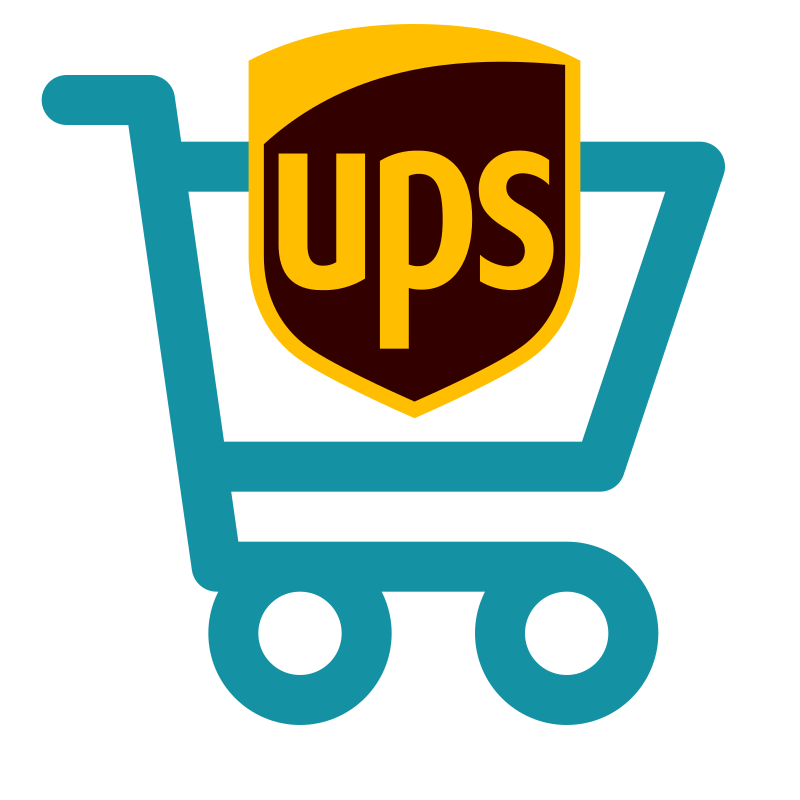
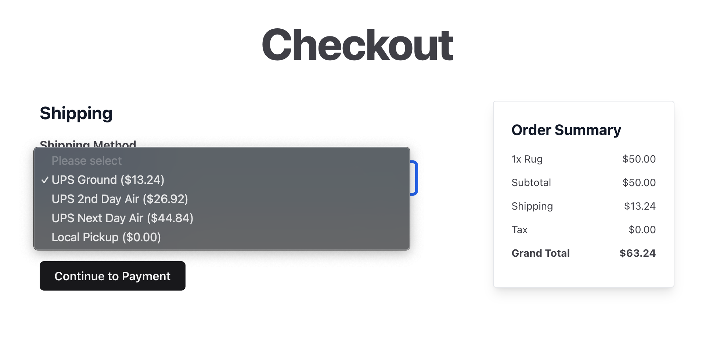

#  Simple Commerce Ups

> Simple Commerce Ups is a Statamic addon that calculates shipping costs from the UPS API.



## Features

This addon:
- Packs items into preset UPS box sizes using the `dvdoug/boxpacker` library.
- Fetches shipping rates from the UPS rates api.

## How to Install

You can search for this addon in the `Tools > Addons` section of the Statamic control panel and click **install**, or run the following command from your project root:

``` bash
composer require darinlarimore/simple-commerce-ups
```

Then, you'll need to publish the config file:

``` bash
php please vendor:publish --tag=simple-commerce-ups-config
```

Then crete the UPS shipping method, name the Shipping method 'UpsGround' for now.
``` bash
php please make:ups-shipping-method
```

## Setup Instructions

### API Credentials
In order to use the UPS api, you'll need to do the following:

1. Go to UPS and login to your account.
2. From the Apps section, follow the prompts to create a new app.
3. Copy the Client ID from UPS and paste in your `.env` file:
```
UPS_CLIENT_ID=your_client_id_here
```

4. Copy the Client Secret from UPS and paste in your `.env` file:
```
UPS_CLIENT_SECRET=your_client_secret_here
```

5. Copy your Account Number from UPS and paste in your `.env` file:
```
UPS_ACCOUNT_NUMBER=your_account_number_here
```

The addon will use these environment variables to authenticate with the UPS API.

### Add a Package Dimensions Field to your Products
Each product needs package dimensions and weight for the packing algorithm to work. Add a package dimensions field to your product blueprint.

The package dimensions field will automatically create nested fields for:
- Weight (in lbs or kg)
- Height (in inches or mm)
- Width (in inches or mm)
- Length (in inches or mm)
- Package Separately (boolean)

These values will be used to calculate optimal box packing and shipping rates.

> Note: Units are determined by your `UPS_UNIT_OF_MEASUREMENT` configuration.

### Add Shipping Method(s)
For each shipping service you want to use (eg. UPS Ground or UPS 2nd Day Air), you'll need to create a new shipping method. To do this,
run `php please make:ups-shipping-method UPS-Ground` which will create a new shipping method in `/app/ShippingMethods/UPSGround.php`.

In the new file, note the `calculateCost()` function. This is where the `fetchShippingRates()` function is called to fetch UPS rates. You can pass in the service code for the UPS service you want to use. The list of service codes available:

- UPS Next Day Air
- UPS 2nd Day Air
- UPS Ground
- UPS Worldwide Express
- UPS Worldwide Expedited
- UPS Standard
- UPS 3 Day Select
- UPS Next Day Air Saver
- UPS Next Day Air Early A.M.
- UPS Worldwide Express Plus
- UPS 2nd Day Air A.M.
- UPS Saver
- UPS Today Standard
- UPS Today Dedicated Courier
- UPS Today Intercity
- UPS Today Express
- UPS Today Express Saver

Create a new shipping method for each service you want to use, and modify the name, description, and service code within each method.

### Add Shipping Method to Simple Commerce Config
In the `config/simple-commerce.php` file, add the new shipping method to the shipping `methods` array.

```php
'shipping' => [
		'methods' => [
				\App\ShippingMethods\UPSGround::class => [],
		],
],
```

## Box Management

UPS shipping rates are calculated based on package dimensions and weight. The addon includes a box management interface in the control panel under "Simple Commerce > UPS Boxes".

### Default Boxes

The addon comes with several pre-configured UPS box sizes:
- UPS Letter (12.5 x 9.5 x 0.25 in)
- Tube (38 x 6 x 6 in)
- 10KG Box (16.5 x 13.25 x 10.75 in)
- 25KG Box (19.75 x 17.75 x 13.25 in)
- Small Express Box (13 x 11 x 2 in)
- Medium Express Box (16 x 11 x 3 in)
- Large Express Box (18 x 13 x 3 in)

### Custom Boxes

You can add custom box sizes through the control panel. Each box requires:
- Name
- Length
- Width
- Height
- Box Weight (empty box weight)
- Maximum Weight Capacity

All measurements respect your `unitOfMeasurement` configuration (metric or imperial).

### Package Separately Option

Products can be configured to ship in individual boxes by enabling the `package_separately` option in the package dimensions.

When enabled, each item quantity will be packed in its own box instead of attempting to combine multiple items in a single box.

## Configuration

### Unit of Measurement

Set `UPS_UNIT_OF_MEASUREMENT` in your .env file:
```
UPS_UNIT_OF_MEASUREMENT=metric    # Use millimeters and grams
UPS_UNIT_OF_MEASUREMENT=imperial  # Use inches and pounds
```
### Test Endpoint

Set `UPS_USE_TEST_ENDPOINT` in your .env file:
```
UPS_USE_TEST_ENDPOINT=true   # Use UPS test/sandbox environment
UPS_USE_TEST_ENDPOINT=false  # Use UPS production environment
```

### Ship From Address

Set shipping origin address in your .env file:
```
UPS_SHIP_FROM_POSTAL_CODE=46202      # Origin postal/zip code
UPS_SHIP_FROM_COUNTRY_CODE=US        # Origin country code
UPS_SHIP_FROM_CITY=Indianapolis      # Origin city
UPS_SHIP_FROM_STATE_CODE=IN          # Origin state/province code
```

### Pickup Type

Set your UPS pickup type in .env:
```
UPS_PICKUP_TYPE="Daily Pickup"  # Options: Daily Pickup, Customer Counter, One Time Pickup, On Call Air, Letter Center, Air Service Center
```
